## Notes
- **1.** UE5的缓存位置改变
  - **a.** UE4的引擎版本缓存可以根据[UE4/5更改缓存路径，为C盘减压（各种版本通用方法）_ue缓存位置修改](https://blog.csdn.net/weixin_55969675/article/details/135741340)中的更改
  - **b.** UE5的引擎版本需要如下所述改动
    - **i.** 把引擎的**BaseEngine.ini**中的DataPath=%ENGINEVERSIONAGNOSTICINSTALLEDUSERDIR%Zen/Data改成DataPath=%GAMEDIR%DerivedDataCache/Zen/Data
- **2.** VS/VAX相关
  - **a.** 列出一些最常用的快捷键

| 快捷键 | 说明 | 备注 |
| --- | --- | --- |
| Shift+Alt+F | 查找该变量的相关引用 |  |
| Alt+G | 快速跳转，如由声明跳转到实现，由实现跳转到声明。 | 光标要在标识符处 |
| Alt+O | .h与.cpp文件的快速切换 |  |
| Alt+Shift+F | 查找标识符所有被引用的位置 | 光标要在标识符处 |
| Alt+Shift+O | 查找整个Solution下的某个文件 | O-Open，打开指定的文件 |
| Alt+Shift+S | 查找标识符 | S-Symbol |
| Alt+Shift+R | 重命名标识符 | 光标要在标识符处,R-ReName |
| Ctrl+Shift+V | 选择剪切板的内容进行粘贴 |  |
| Ctrl+T | 全局查找 |  |
| Shift+Alt+F | VAX智能查找 |  |
| Alt+Enter | 快速生成定义 |  |
| Ctrl+K然后Ctrl+D | VisualStudio全局格式化快捷键 |  |

- **3.** 虚幻引擎的cmd指令
  - **a.** stat initviews - drawcall、遮挡剔除等渲染信息
  - **b.** r.HZBOcclusion 1/0  - 通知GPU启用/关闭遮挡剔除
- **4.** 在VR移动端项目启动时附加命令行
  - **a.** 将一个名为 UECommandLine.txt 的文件添加到设备上的项目安装文件夹中。该文件UE4中名为 UE4CommandLine.txt，UE5中改名了，以防程序找到对它的旧线程引用。
  - **b.** [UE官方文档 - Command-Line Arguments](https://dev.epicgames.com/documentation/en-us/unreal-engine/command-line-arguments-in-unreal-engine)
- **5.** adb 快捷键
  - **a.** 指令退出当前程序：adb shell am force-stop com.YourCompany.MR_Ultraman
  - **b.** Pico相关的调试指令可见：[PICO 图像分析和调试工具](https://developer-cn.picoxr.com/document/unreal/pico-graphics-probe-tool/)
- **6.** 虚幻引擎自带的Bechmark/自动化性能测试工具
  - **a.** AutomatedPerfTestPlugin
  - **b.** Gauntlet
- **7.** 统计当前目录下的代码总行数

```
Get-ChildItem -Path . -Recurse -Include *.h,*.cs, *.cpp | Get-Content | Measure-Object -Line
```

- **8.** 如何直接将某个变量Get为Valid判断格式？
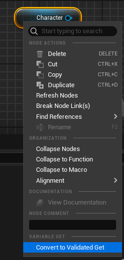
- **9.** 虚幻引擎渲染体系学习文章：[剖析虚幻渲染体系-开篇说明 - 向往](https://zhuanlan.zhihu.com/p/542537553)
  - **a.** 针对于移动端的快速优化意见：[移动游戏性能优化通用技法 - 向往](https://zhuanlan.zhihu.com/p/568165512)
  - **b.** 移动端优化专题：[剖析虚幻渲染体系（12）- 移动端专题（01）](https://zhuanlan.zhihu.com/p/555462370)
- **10.** 虚幻引擎TA文章：
  - **a.** [虚幻4渲染编程专题概述及目录](https://zhuanlan.zhihu.com/p/36675543)
  - **b.** [虚幻4渲染编程(Shader篇)【第十二卷：MeshDrawPipline】](https://zhuanlan.zhihu.com/p/61464613)
- **11.** 线性变换、矩阵计算重要文章
  - **a.** [《UnityShader入门精要》学习笔记——第四章(下）：学习Shader所需的数学基础](https://zhuanlan.zhihu.com/p/414740003)
- **12.** UE insights工具使用说明：[Unreal Insights](https://dev.epicgames.com/documentation/en-us/unreal-engine/unreal-insights-in-unreal-engine?application_version=5.4)
- **13.** 虚幻引擎材质渲染相关教程：[Graphics Programming](https://dev.epicgames.com/documentation/en-us/unreal-engine/graphics-programming-for-unreal-engine?application_version=5.4)
- **14.** blueprintUE - 一个玩家分享自己蓝图的网站：[blueprintUE](https://blueprintue.com/)
- **15.** 官方视频：[[英文直播] 理解剔除方法 | Understanding Culling Methods (真实字幕组)](https://www.bilibili.com/video/BV1pJ411G7AB/?spm_id_from=333.1007.top_right_bar_window_custom_collection.content.click&vd_source=30b5d6dd5435961e25b24fcc71e401d8)
  - **a.** 交互式艺术展馆工具： artexpovr
- **16.** RDG相关：
  - **a.** [Render Dependency Graph](https://dev.epicgames.com/documentation/en-us/unreal-engine/render-dependency-graph-in-unreal-engine?application_version=5.4)
  - **b.** [RDG 101_ A Crash Course.pptx](https://epicgames.ent.box.com/s/ul1h44ozs0t2850ug0hrohlzm53kxwrz)
- **17.** 剔除优化
  - **a.** 相关视频：[[英文直播] 理解剔除方法 | Understanding Culling Methods (真实字幕组)](https://www.bilibili.com/video/BV1pJ411G7AB/?spm_id_from=333.1007.top_right_bar_window_custom_collection.content.click&vd_source=30b5d6dd5435961e25b24fcc71e401d8)
  - **b.** Software Occlusion Queries for Mobile：[Software Occlusion Queries for Mobile](https://dev.epicgames.com/documentation/en-us/unreal-engine/software-occlusion-queries-for-mobile?application_version=4.27)
  - **c.** 循环遮挡：Querying
  - **d.** [UE4渲染-遮挡剔除 - 知乎](https://zhuanlan.zhihu.com/p/526622741)
- **18.** 虚幻引擎比较重要的几个网站：
  - **a.** [学习库 Unreal Engine](https://dev.epicgames.com/community/unreal-engine/learning?query=mobile)
  - **b.** [l/zh-Hans/wemake/service/unreal-engine/support](https://dev.epicgames.com/portal/zh-Hans)
- **19.** 如何将Material保存为RenderTarget
  - **a.** 在Actor中自定义一个custom event调用Draw Material to Render Target函数，然后在的Construction Script事件中调用这个CustomEvent即可。详细文档见：[Creating Textures Using Blueprints and Render Targets](https://dev.epicgames.com/documentation/en-us/unreal-engine/creating-textures-using-blueprints-and-render-targets?application_version=4.27)

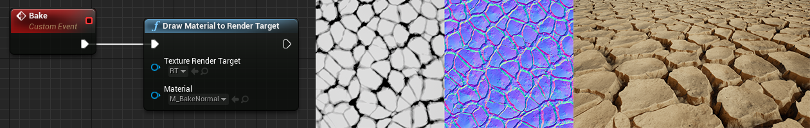
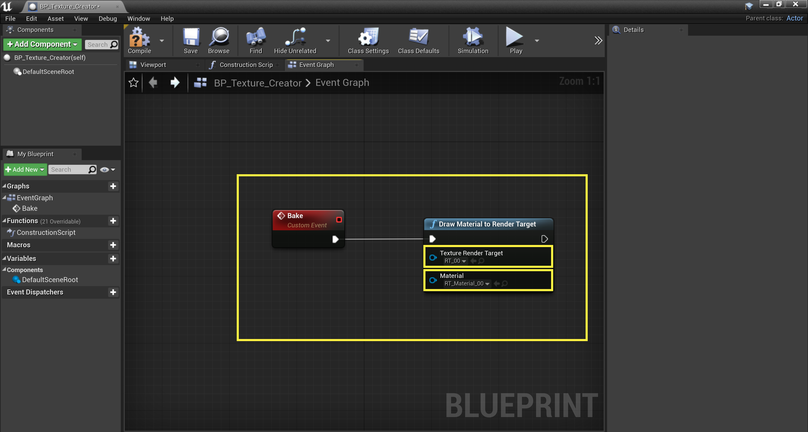

- **11.** StereoLayer相关
  - **a.** 如何让StereoLayer左右眼分开显示（单目画面显示）：不需要显示的那只眼直接赋值一个透明Alpha通道的Texture或者RT即可

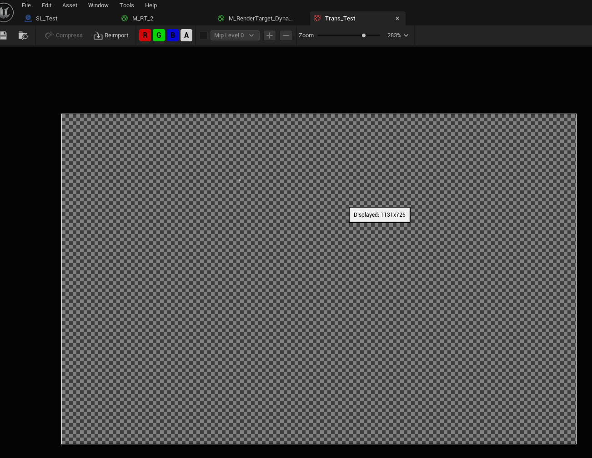
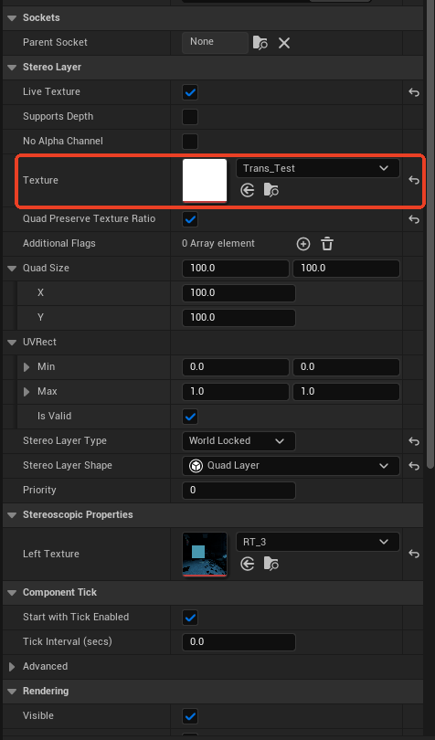

  - **b.** 如何用StereoLayer显示SceneCapture2D实时捕捉画面
    - **i.** 先放置SceneCapture2D，绑定一张RT，这里用RT_2标识
    - **ii.** 由于SC2D捕获的RT的Alpha通道是逆Alpha通道，所以需要用材质反转一下RT_2的Alpha通道
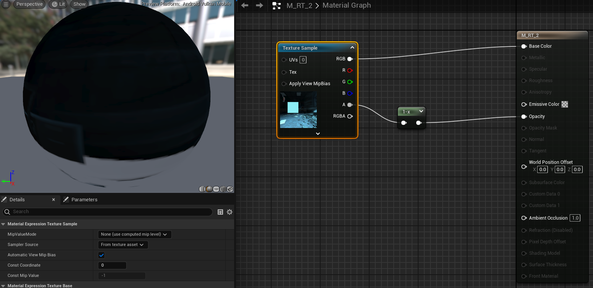
    - **iii.** 然后在Actor中自定义一个函数用来将材质绘制回RT，这里绘制回RT_3
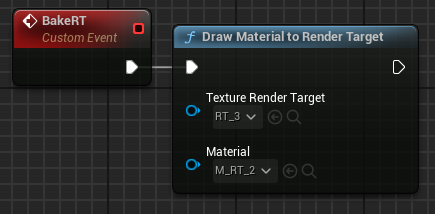
    - **iv.** 赋值StereoLayer相关Texture，并按照下图设置：
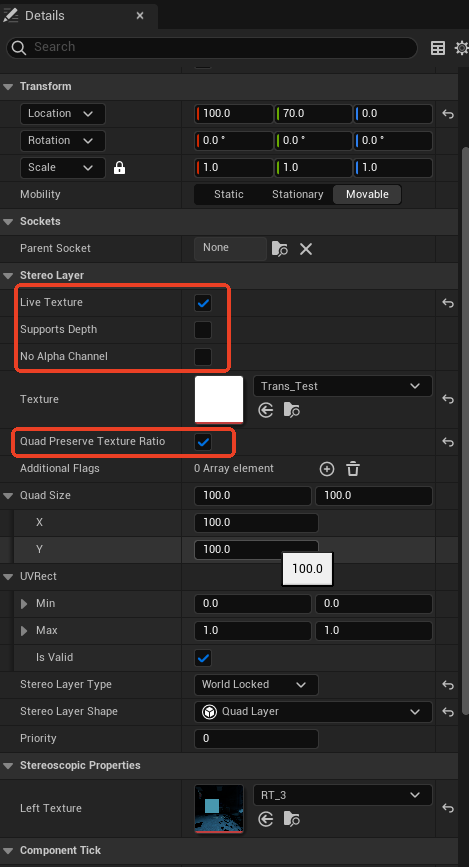
    - **v.** TODO：保存材质至RT发现没有Alpha通道信息，为什么？
- **12.** Mobile VR环境下如何让每只眼睛显示不同内容？
  - **a.** 方案：使用材质中的Custom节点，然后用ResolvedView.StereoPassIndex;函数来获取左右眼判断：左眼输出为0右眼输出为1
  - **b.** 参考文档：[How to make Each eye shows different content？](https://forums.unrealengine.com/t/how-to-make-each-eye-shows-different-content/1427741/7)
  - **c.** 示例：
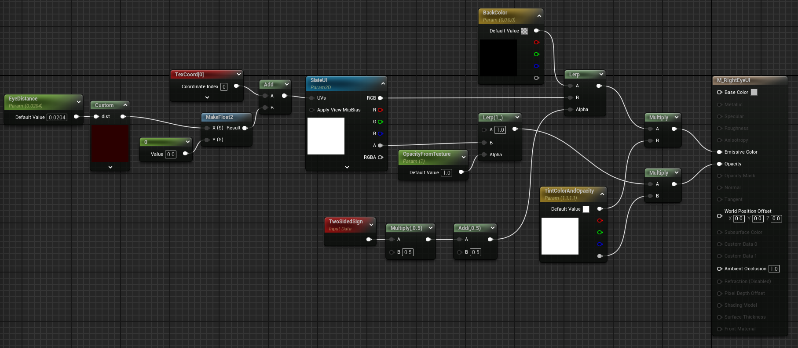

```cpp
if (ResolvedView.StereoPassIndex == 0) 
{
return dist;
}
else
{
return dist * -1.0;
}
```

  - **d.** 也可以参考官方案例（虚幻引擎官方VR模板）：

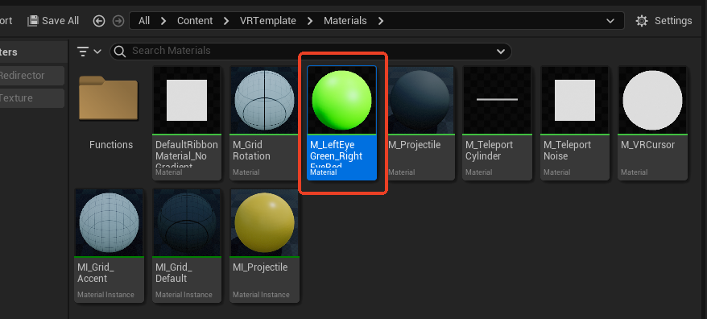
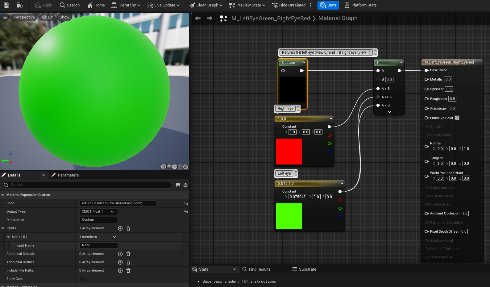

- **13.** 其他重要的教程：
  - **a.** [[FestEurope2019] 蓝图深入探讨 | Blueprints In-depth (官方汉化)](https://www.bilibili.com/video/BV1sJ41167np/?spm_id_from=333.1387.search.video_card.click&vd_source=30b5d6dd5435961e25b24fcc71e401d8)
- **14.** 光线步进算法，自由修改SSR等光线步进效果
  - **a.** 功能：通过光线步进算法，实现自己的想要的功能
  - **b.** 参考:[[UE4] [后处理材质] 屏幕空间反射原理和实现](https://www.bilibili.com/video/BV1YB4y1U7Ni/?spm_id_from=333.1387.favlist.content.click&vd_source=30b5d6dd5435961e25b24fcc71e401d8)
  - **c.** 关键代码：

```cpp
float3 p = BeginPos,xyz;
float3 reflectVec = RefVec.xyz;
float2 uv = 0;
float3 OUT = float3(1,1,0);
float3 lastPos = 0;
for( int i = 0 ; i < Count ; i++ )
{
//
p += reflectVec * RayLength;
//
//float4 svPos = mul( float4(p,1.0) , ResolvedView.WorldToClip );
float4 svPos = mul( float4(p,1.0) , ResolvedView.TranslatedWorldToClip );
uv = svPos.xy / svPos.w;
// uv.y *= -1;
uv = uv*0.5+0.5;
//
#if(ES2_PROFILE||ES3_1_PROFILE||MOBILE_EMULATION)
float _depth = MobileSceneTextureLookup(Parameters,PPI_SceneDepth,uv).r;
#else
float _depth = SceneTextureLookup(uv,PPI_SceneDepth,false).r;
#endif
//UV Out of Range
if( uv.x > 1.0 || uv.x < 0.0 || uv.y > 1.0 ||uv.y < 0.0 )
{
OUT.xy = uv;
OUT.z = 0.0;
break;
}
//
if(svPos.w > _depth && svPos.w < (_depth + RayLength))
{
OUT.xy = uv;
OUT.z = 1.0;
break;
}
lastPos = p;

}
return OUT;
```

  - **d.** 材质蓝图中的重点部分(见材质M_VirtualBody_0611)
**[M_VirtualBody_0611.uasset]**

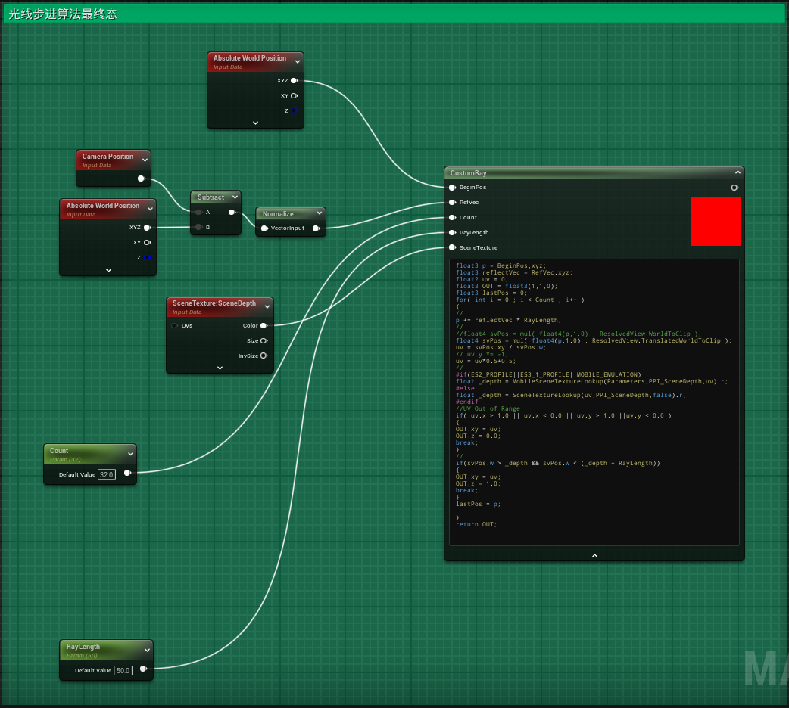
- **15.** Pico官方适配的SeeThrough显示所需要的材质比较特殊，需要设置以下几个选项后才行：

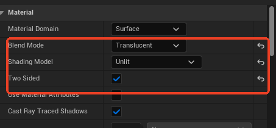
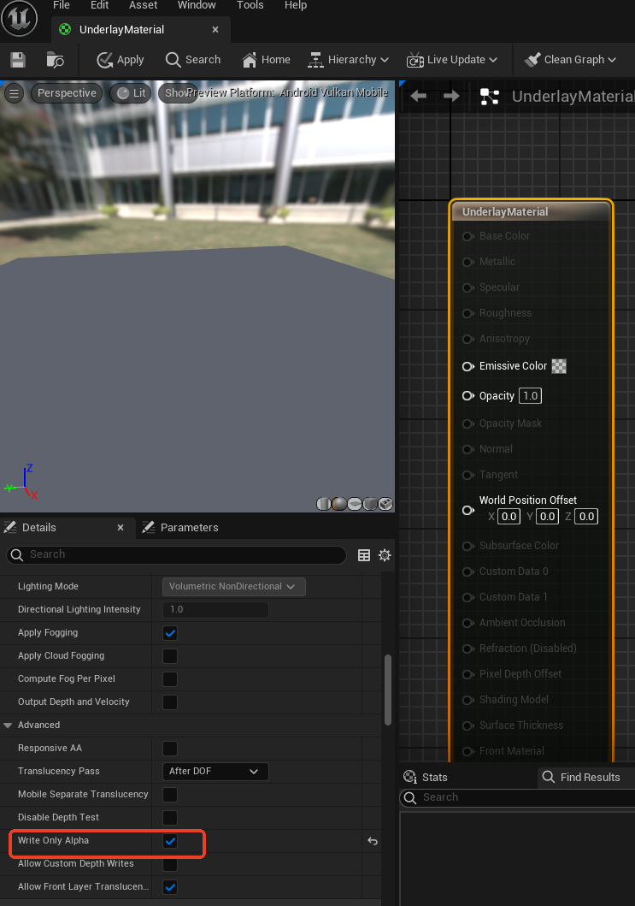


- **16.** 怎么样获取一个像素周边的像素？
  - **a.** 使用BlurSampleOffsets材质节点。可以快速实现边框效果：
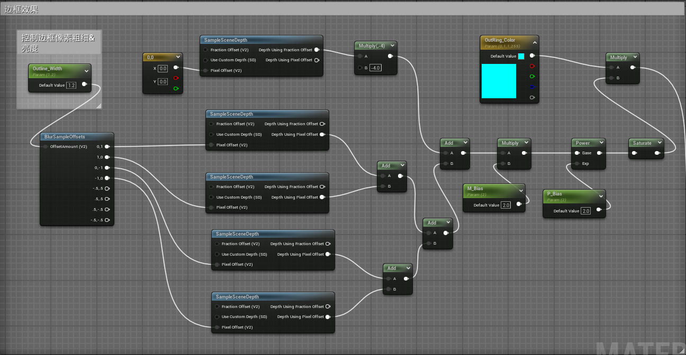
  - **b.** 用SceneTexelSize来获取：
    - **i.** 举个例子，比如现在有个像素点的uv为（0.2，0.6），那么这个像素上方的像素点则为（0.2，0.6-0.000926），下方则为（0.2，0.6+0.000926），左右同理（因为UE4中uv坐标系原点在左上角，所以这里向上为减，向下为加）
- **17.** 好用的图像可视化工具：
  - **a.** [【中文配音】Manim进阶教程](https://www.bilibili.com/video/BV18gmAYSEHa/?spm_id_from=333.788.videopod.episodes&vd_source=30b5d6dd5435961e25b24fcc71e401d8)
- **18.** Git相关
  - **a.** 更新仓库拉取深度：git fetch --depth=10
  - **b.** 更新仓库从浅克隆状态转变为完整克隆：git fetch --unshallow
    - **i.** 转变为完整克隆后，如果说感觉太卡的话，也可以继续用浅克隆指令将仓库历史截断为最近的 N 次提交。
  - **c.** 在编辑器中显示最后修改某一行的人：[如何在 Visual Studio 2013 中显示"git blame"？](https://stackoverflow.com/questions/25076311/how-can-i-show-git-blame-in-visual-studio-2013)
- **19.** **渲染依赖性图表（Rendering Dependency Graph）**
**[RDG 101_ A Crash Course.pptx]**

**[rdg-insights-presentation.pdf]**

  - **a.** [UE官方文档 - 渲染依赖图](https://dev.epicgames.com/documentation/zh-cn/unreal-engine/render-dependency-graph-in-unreal-engine)
  - **b.** **官方教程ppt**
    - **i.** [UE4 渲染依赖性图表Rendering Dependency Graph深度解析](https://www.bilibili.com/opus/365917886337855683)
    - **ii.** [UOD2022 Rendering Dependency Graph解析](https://zhuanlan.zhihu.com/p/29138708585)
- **20.** UE5.4新的渲染特性及应用
  - **a.** [Designing Visuals, Rendering, and Graphics](https://dev.epicgames.com/documentation/en-us/unreal-engine/designing-visuals-rendering-and-graphics-with-unreal-engine?application_version=5.4)
- **21.** 如何在不改引擎源码情况下扩展渲染管线
  - **a.** 使用Scene Extention。参考
    - **i.** [[UnrealCircle成都]在外部模块（插件）中扩展复杂渲染管线实践 | Angelou lv 吕源丰 腾讯生态发展部](https://www.bilibili.com/video/BV1VJ4m157sq?spm_id_from=333.788.videopod.sections&vd_source=30b5d6dd5435961e25b24fcc71e401d8)
    - **ii.** [[UnrealCircle武汉]通过Scene Extension扩展渲染器 | 王祢 Epic](https://www.bilibili.com/video/BV1fM4m1U7Tp?spm_id_from=333.788.videopod.sections&vd_source=30b5d6dd5435961e25b24fcc71e401d8)

## Problem & Solution
- **1.** VS2022配置勾选：[https://zhuanlan.zhihu.com/p/466116012](https://zhuanlan.zhihu.com/p/466116012)
- **2.** Android打包配置：
  - **a.** [https://zhuanlan.zhihu.com/p/639130726](https://zhuanlan.zhihu.com/p/639130726)
  - **b.** [https://www.bilibili.com/opus/862211656744173616](https://www.bilibili.com/opus/862211656744173616)
- **3.** UE打包时报错**：ERROR: cmd.exe failed with args**
  - **a.** 分析：UEC++代码变动导致缓存失效，引擎尝试复用现有缓存导致的错误。通常是UEC++中新增了一些没有实现反射的类或者全局变量导致的
  - **b.** 解决方案：直接删除项目下的Intermediate文件夹，重新Generate sln文件并重新进行打包。
- **4.** UE5.4 打包 Android, gradle time out下载失败
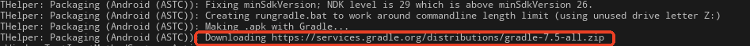
  - **a.** 解决办法：
    - **i.** 前往[https://services.gradle.org/distributions/](https://services.gradle.org/distributions/) 网站找到对应版本(或者去星辰大海里找找)，下载个**gradle-7.5-all**(不用解压)
    - **ii.** UE打包时会自动下载Gradle，会在以下路径创建文件夹开始下载.zip：**C:\Users\user\.gradle\wrapper\dists\gradle-7.5-all(对应版本)\6qsw290k5lz422uaf8jf6m7co\**
    - **iii.** UE打包时自动下载，电脑目录正常都是6qsw290k5lz422uaf8jf6m7co这个文件夹
    - **iv.** 将网站下载好的zip直接扔进UE创建的6qsw290k5lz422uaf8jf6m7co文件夹中，重新运行打包即可
- **5.** 安装Android Studio时，报错：**SDK emulator directory is missing**
  - **a.** 按照文章[https://zhuanlan.zhihu.com/p/962652987](https://zhuanlan.zhihu.com/p/962652987)中的方式配置国内镜像重新下载SDK
  - **b.** 或者挂上VPN后，选择：
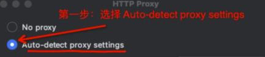
  - **c.** 自动从国外默认节点下载SDK
- **6.** 打包时的UAT、报错：
  - **a.** 类似的报错：UATHelper: Packaging (Android (ASTC)): RunUAT.bat ERROR: Visual studio and/or AutomationTool.csproj was not found, nor was Engine\Binaries\DotNET\AutomationTool\AutomationTool.dll. Can't run the automation tool.
  - **b.** 尝试验证引擎本身
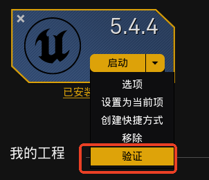
  - **c.** 安装dotnet-sdk-3.1.115
**[dotnet-sdk-3.1.115-win-x64.exe]**

- **7.** 打包报错： LogCook: Error: Content is missing from cook
  - **a.** 详细报错：
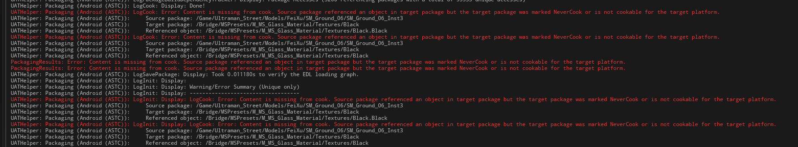
  - **b.** 原因分析：
    - **i.** [Quixel Megascans fails to build to the Apple Vision Pro in 5.4](https://forums.unrealengine.com/t/quixel-megascans-fails-to-build-to-the-apple-vision-pro-in-5-4/1819932)
    - **ii.** Android并未列为 Bridge 插件的支持平台
  - **c.** 解决方案：
    - **i.** 在对应引擎版本的Bridge.uplugin中的平台支持中加入安卓平台支持
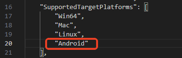
- **8.** 工程中的视频无法正常播放，并且打包时会报错
  - **a.** 报错信息："**LogWmfMedia: Error: An error occurred in the media session: No suitable transform was found to encode or decode the content.**"
  - **b.** 报错原因分析：项目采用的8K视频需要HEVC解码支持，Win10的默认环境中没有对应的解码插件（Win11自动包含），需要单独下载安装
  - **c.** 解决办法：参考[Image and video codecs and import formats](https://dev.epicgames.com/community/learning/knowledge-base/yzP1/capturing-reality-image-and-video-codecs-and-import-formats)文章，下载 HEIF、HEVC的编解码插件支持
- **9.** 场景中的VST显示不正常/没有生效
  - **a.** 原因分析及解决办法：原因是当想要实现背景透视效果时，要么将包裹场景的Box反转法线，要么将材质设置为two-side

- **9.** 打包安卓时有个默认的HUD布局
  - **a.** 问题展示：
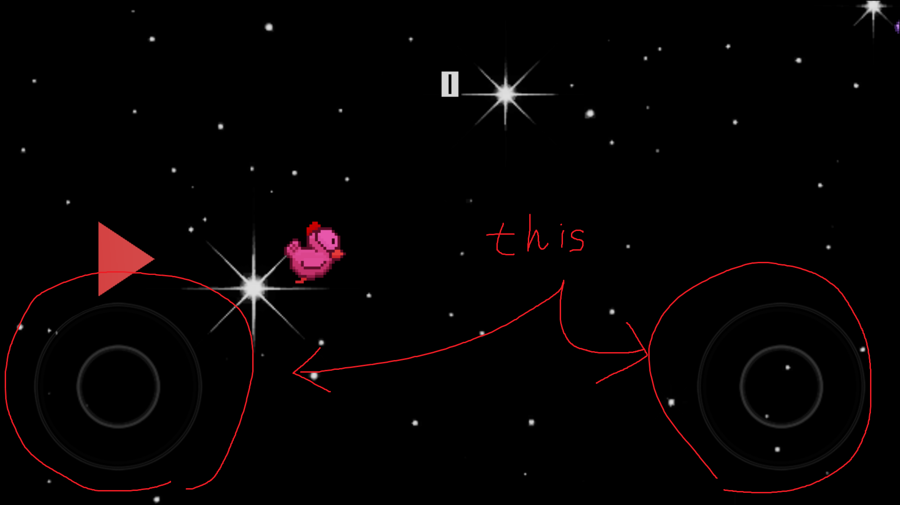
  - **b.** 解决方案：
    - **i.** project settings>input>mobile>default touch interface 设置为"无"
- **10.** UE5.4中，运行时纵横比异常导致FOV异常
  - **a.** UE5.3开始，纵横比变成了Y轴垂直纵横比，而不是水平纵横比，导致FOV对不上
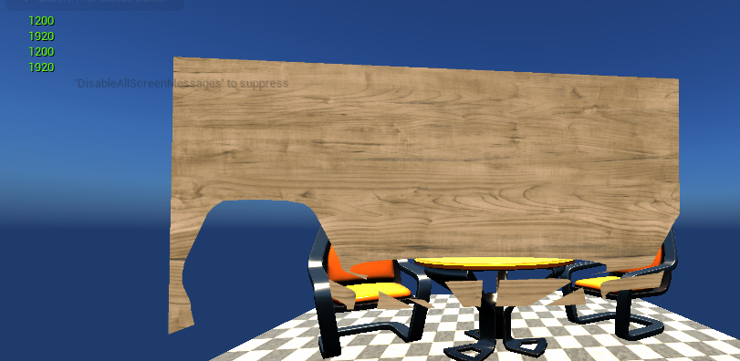
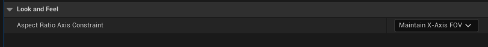
  - **b.** [UE 5.3 约束纵横比行为异常](https://forums.unrealengine.com/t/ue-5-3-constraint-aspect-ratio-misbehaviour/1328275)
  - **c.** 勾选相机的限制纵横比选项，确保选择的宽高比值与最终渲染分辨率相匹配。例如，如果您选择 1.77（16:9）裁剪，则必须以相应的 16:9 分辨率（1280 x 720、1920 x 1080、3840 x 2160 等）进行渲染。详见：[影片渲染队列输出与序列器/视口不匹配](https://forums.unrealengine.com/t/movie-render-queue-output-does-not-match-sequencer-viewport/1714994)
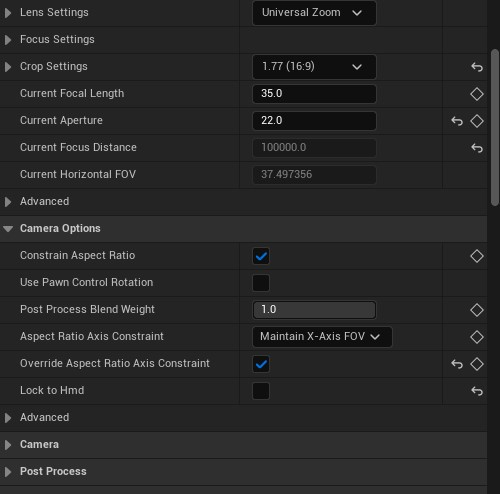
- **11.** 采用Widget 3D，将Widget附到相机视口的合适相对位置及缩放比例记录：
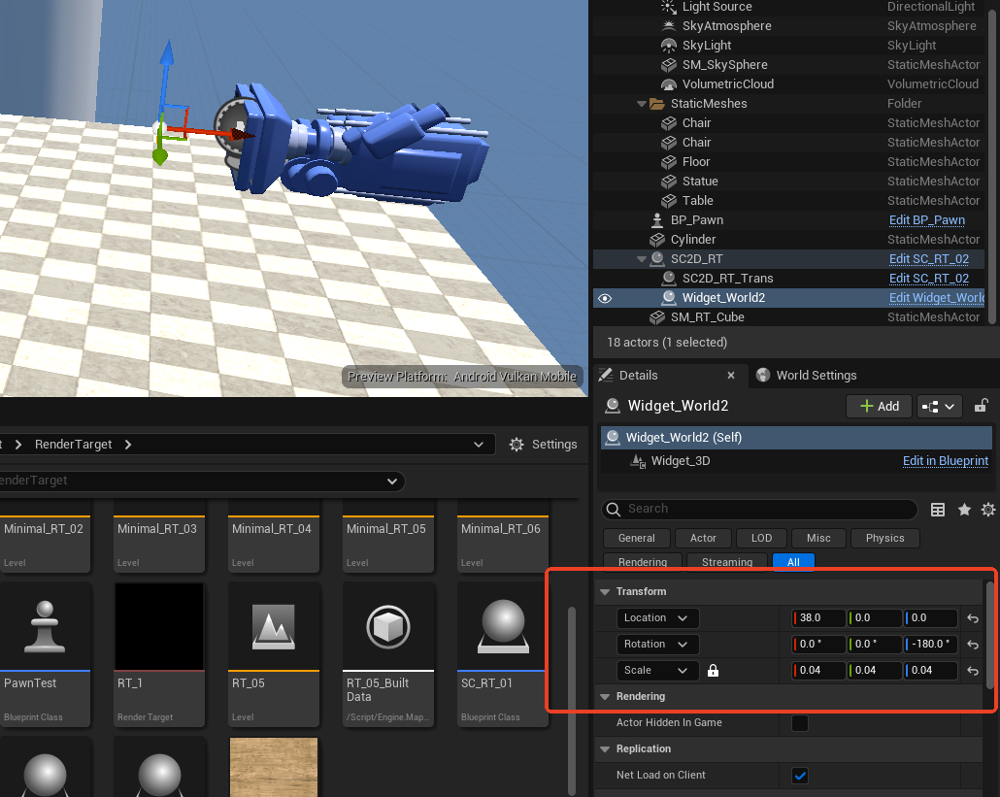
- **12.** StereoLayer在的项目打不开的问题
  - **a.** 有时候用StereoLayer，发现项目一直转圈圈打不开，也没有报崩溃。log如下
**[log.txt]**

  - **b.** 原因及解决方案：StereoLayer的Compression Settings可能错误地设置为了Userinterface2D (RGBA)或者其他格式
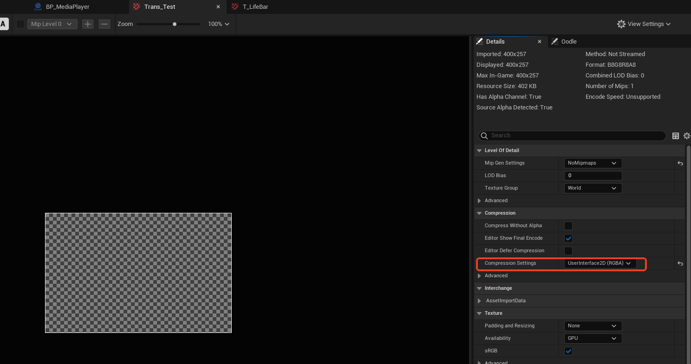
  - **c.** 将其将其改为"Default (DXT1/5, BC1/3 on DX11)"即可
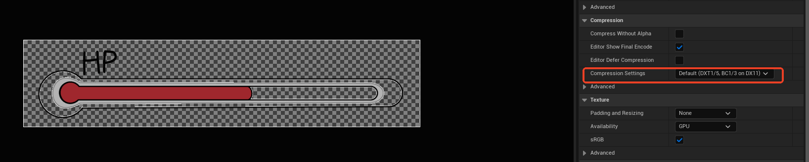
- **13.** **error C4756: 常量算法中溢出**
  - **a.** 原因：用了Win11最新的SDK，详情见[https://zhuanlan.zhihu.com/p/16534167796](https://zhuanlan.zhihu.com/p/16534167796)
  - **b.** 解决方案：删掉更高版本的WinSDK，换成Windows 10 SDK 10.0.18362 SDK，或者Windows 11 SDK（10.0.22621.0)
- **14.** Pico源码分支编译运行转换后的项目时报错GenericPlatform错误：
  - **a.** 原因分析：源码分支自己的PicoXR Plugin与项目的插件冲突了
  - **b.** 解决方案：删除项目自己的PicoXR Plugin即可
- **15.** 打包shipping模式后，运行Install_MR_Ultraman-Android-Shipping-arm64.bat后报错
  - **a.** 报错内容：adb: failed to stat AFS_MR_Ultraman-Android-Shipping-arm64.apk: No such file or directory
  - **b.** 原因分析：原bat内容中，install语句多了前缀AFS
  - **c.** 解决方案：去掉前缀"AFS_"————仍然不行
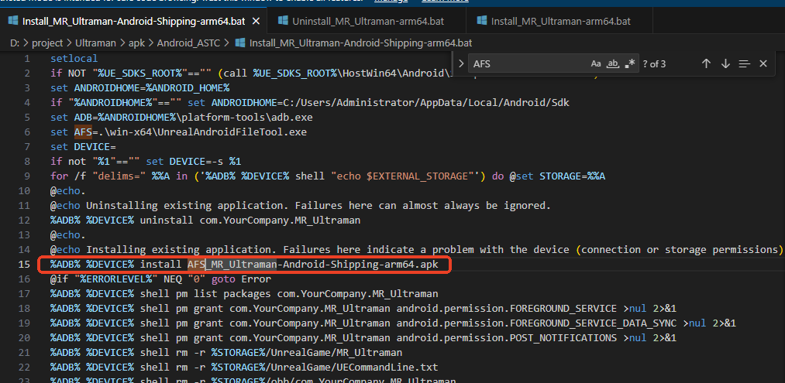
- **16.** 一个Niagara的问题：
  - **a.** 在场景中没有Niagara时，开着Multiview的话，右眼复用左眼的CustomDepth，导致右眼的Custom Depth无法正常使用。
  - **b.** 场景中有Niagara并且Niagara中包含了MeshRenderer的话，会发现场景中右眼的CustomDepth问题被修复了，但是右眼图像像是复制了左眼视口的图像一样。
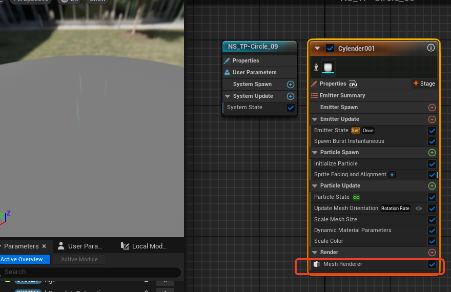
  - **c.** 这种情况是由于Mesh所使用的材质引起的。场景中只要某个区域有这个材质，就会触发这个问题
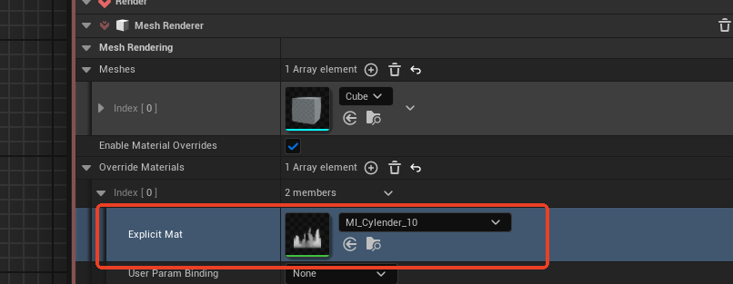
  - **d.** 进一步分析是由这个节点引起的：
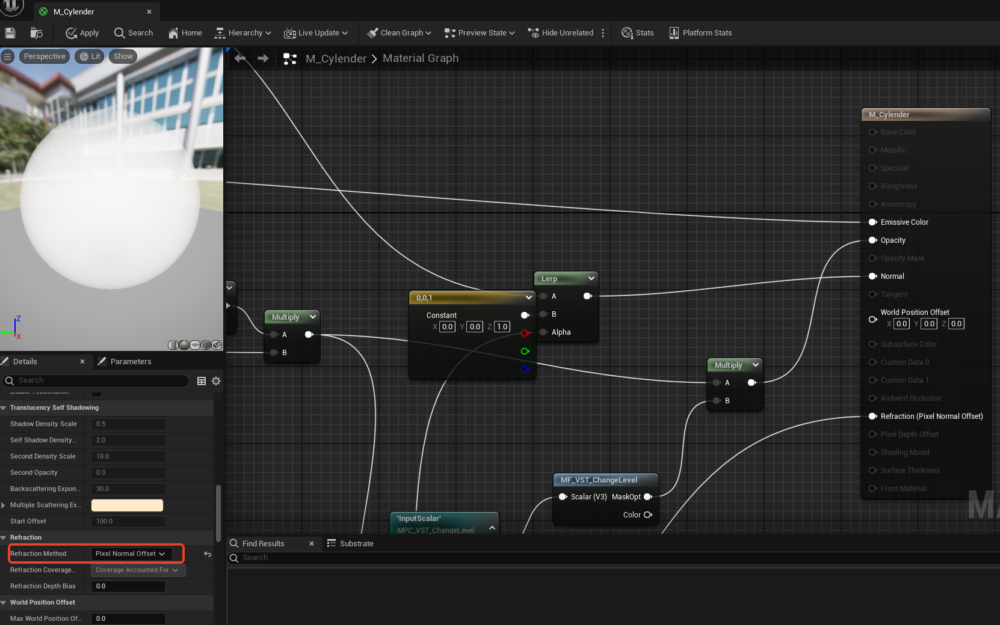
  - **e.** 由于这个Refraction Method引起的问题：当Refraction Method模式为Pixel Normal Offset时，就会出现这个问题。场景中右眼的CustomDepth问题被修复了，但是右眼图像像是复制了左眼视口的图像一样。
  - **f.** 详见文章：[像素深度偏移——如何获得正确的投影而没有透视失真？](https://forums.unrealengine.com/t/pixel-depth-offset-how-to-get-the-correct-projection-without-perspective-distortion/54468)
- **17.** 虚幻引擎构造函数报错：LNK2005/LNK1169等重定义错误
  - **a.** 原因：如果定义的是GENERATED_UCLASS_BODY()，那么意味着使用父类的构造函数，也就是说，不需要为自己声明构造函数，直接去实现父类声明那个构造函数。而如果是如果定义的是GENERATED_BODY()，那么意味着需要自己实现构造函数，这个时候如果实现父类声明那个构造函数的话就会报重定义错误。
  - **b.** 把GENERATED_BODY()改为GENERATED_UCLASS_BODY()即可。
  - **c.** 不过现在不建议用GENERATED_UCLASS_BODY()了。可以参考[https://zhuanlan.zhihu.com/p/649765047](https://zhuanlan.zhihu.com/p/649765047)来使用GENERATED_BODY()代替
- **18.** UEC++编译报错：**use of undeclared identifier 'GetWorld'**
  - **a.** **分析：**对于被Static修饰的静态函数来说，无法直接通过GetWorld()函数来获取当前所处的世界索引。
  - **b.** **解决办法：**GWorld->GetWorld()
- **19.** 打开UE编辑器后所有二级界面都打不开了，比如蓝图，材质等等。
  - **a.** **分析：**引擎莫名其妙的崩溃，常见于电脑太卡/显存占用过高时
  - **b.** **解决办法：**
    - **i.** 如图所示，重置窗口布局
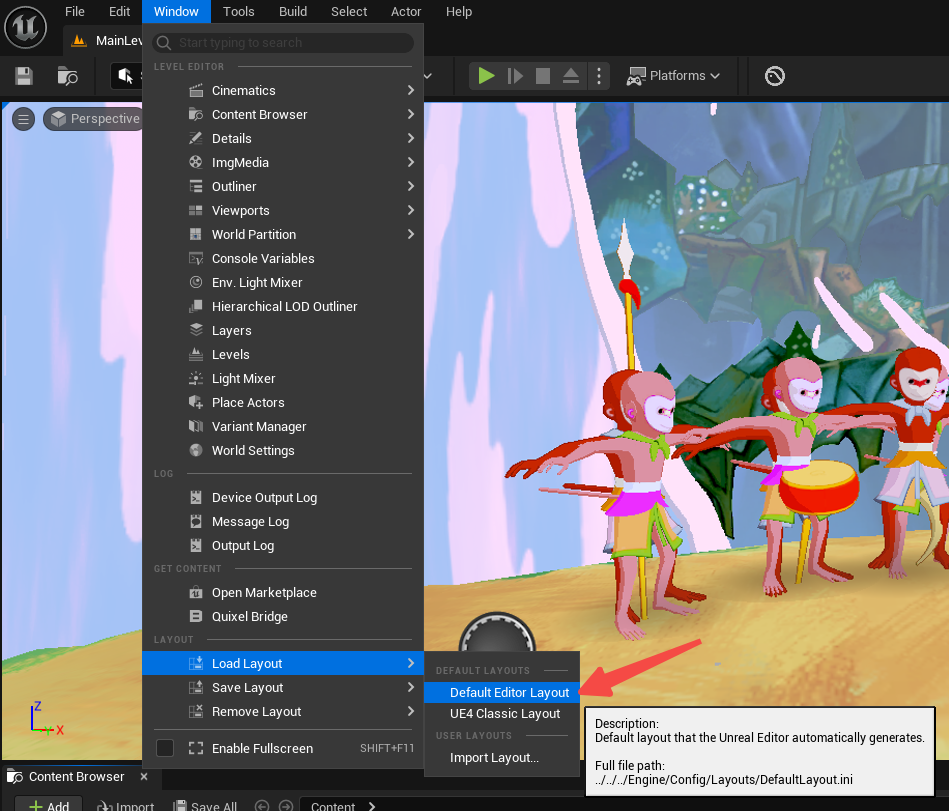
    - **ii.** 如果还是不行，直接删了C:\Users\Administrator\AppData\Local\UnrealEngine下的所有内容即可（根据自己电脑路径找到这个AppData\Local\UnrealEngine目录）
- **20.** 打包基于UE5.6的Android程序失败，Build Failed
  - **a.** 按照[https://www.youtube.com/watch?v=Tb-DuxNC6Lg](https://www.youtube.com/watch?v=Tb-DuxNC6Lg)视频内容，下载一下所有的 **sdk toolchain** 以及**NDK 27.3.13750724**版本，并把TargetNDK改成27版本
  - **b.** 修改环境变量中的JAVA_HOME（按照自己电脑上的Java路径来），从C:\Program Files\Android\Android Studio\jbr改为C:/Program Files/Java/jdk-18.0.2.1
  - **c.** SDK版本换成**34**，不是35或者matchndk
  - **d.** 需要取消勾选online subsystem googleplay插件，否则打包会出现乱码错误

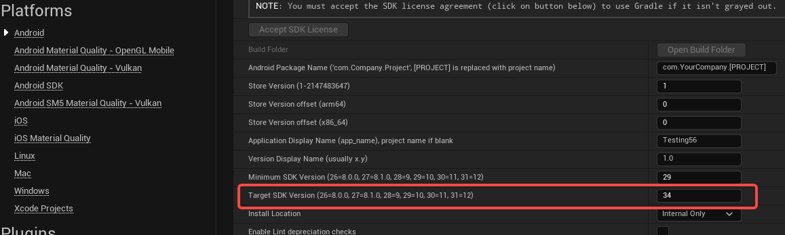
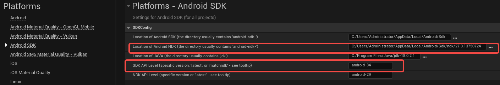

## Other Reference
- **1.** [虚幻引擎的实时渲染基础](https://zhuanlan.zhihu.com/p/15066524228)
- **2.** [虚幻引擎体积云系统剖析（上）](https://zhuanlan.zhihu.com/p/645281439)
